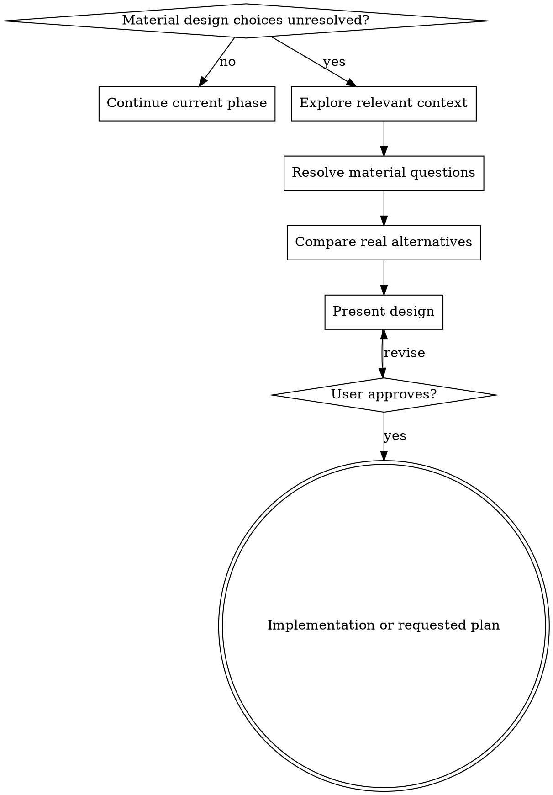

# Brainstorming Ideas Into Designs

Help turn ideas into fully formed designs and specs through natural collaborative dialogue.

Start by deciding whether design work is actually needed. Use this skill only
when unresolved choices materially affect what should be built.

## Entry Gate

Skip brainstorming and continue with implementation when any of these is true:

- The user supplied a complete or ready-to-execute plan.
- The design was already approved in this conversation or an attached artifact.
- The task is a concrete bug fix with a clear expected behavior.
- The task is a mechanical migration, rename, configuration change, or direct
  application of an established project pattern.
- Implementation or verification is already in progress.

Do not reopen design because a new turn started. Return to design only when
repository evidence reveals a contradiction, blocker, or genuinely missing
decision that prevents safe execution.

When material requirements or tradeoffs are unresolved, do not implement until
you have presented a design and the user has approved it.

## Checklist

Create tasks only for the steps the request actually needs:

1. **Explore project context** — check the relevant files, docs, and conventions.
2. **Ask focused questions** — one at a time, resolving only decisions that
   materially change the design.
3. **Compare real alternatives** — propose 2–3 approaches only when meaningfully
   different options exist; do not invent alternatives for a conventional choice.
4. **Present the design** — scale it to the decision's complexity.
5. **Get one approval** — approval completes design for this scope.
6. **Record the design when required** — write a design document only when the
   user asks for one or project conventions require one.
7. **Transition forward** — begin implementation or produce one implementation
   plan if the user explicitly requested it. Do not brainstorm the same approved
   scope again.

## Process Flow

## The Process

**Understanding the idea:**

- Inspect existing patterns before asking questions the repository can answer.
- Assess scope early. If the request spans independent subsystems, identify the
  boundaries before refining details.
- Ask one focused question at a time.
- Prefer multiple choice when the alternatives are genuinely distinct.
- Focus on purpose, constraints, success criteria, and public interfaces.
- Stop asking when remaining uncertainty does not affect implementation.

**Exploring approaches:**

- Compare alternatives only when they have materially different tradeoffs.
- Lead with the recommended option and explain why it fits the constraints.
- For a single conventional approach, state the choice and proceed instead of
  manufacturing alternatives.

**Presenting the design:**

- Scale each section to its complexity: a few sentences for straightforward
  choices, more detail for nuanced architecture.
- Cover only relevant concerns: components, data flow, errors, testing, and
  rollout as applicable.
- Ask for approval once after the coherent design, rather than after every
  section.

**Design for isolation and clarity:**

- Give each unit one clear purpose and a well-defined interface.
- Make dependencies and invariants explicit.
- Prefer boundaries that can be understood and tested independently.
- Avoid unrelated refactoring.

## After Approval

Approval is a phase transition. Continue forward without another design or
approval cycle:

- If the user requested a written plan, produce one implementation plan.
- Otherwise begin implementation using the approved design.
- If a design document is required, write it once and do not ask the user to
  approve the same content again unless it materially changed.
- Reopen design only for a newly discovered blocker or contradiction.

## Key Principles

- **Resolve material ambiguity** — do not interrogate for inconsequential details.
- **No fake alternatives** — compare approaches only when the choice is real.
- **One approval** — approval closes design for the agreed scope.
- **Monotonic phases** — never restart brainstorming merely because the turn changed.
- **YAGNI ruthlessly** — remove features that do not serve the stated goal.

## Visual Companion

A browser-based companion for showing mockups, diagrams, and visual options during brainstorming. Available as a tool — not a mode. Accepting the companion means it's available for questions that benefit from visual treatment; it does NOT mean every question goes through the browser.

**Offering the companion (just-in-time):** Do NOT offer it upfront. Wait until a question would genuinely be clearer shown than told — a real mockup / layout / diagram question, not merely a UI *topic*. The first time that happens, offer it then, as its own message:
> "This next part might be easier if I show you — I can put together mockups, diagrams, and comparisons in a browser tab as we go. It's still new and can be token-intensive. Want me to? I'll open it for you."

**This offer MUST be its own message.** Only the offer — no clarifying question, summary, or other content. Wait for the user's response. If they accept, start the server with `--open` so their browser opens to the first screen automatically. If they decline, continue text-only and don't offer again unless they raise it.

**Per-question decision:** Even after the user accepts, decide FOR EACH QUESTION whether to use the browser or the terminal. The test: **would the user understand this better by seeing it than reading it?**

- **Use the browser** for content that IS visual — mockups, wireframes, layout comparisons, architecture diagrams, side-by-side visual designs
- **Use the terminal** for content that is text — requirements questions, conceptual choices, tradeoff lists, A/B/C/D text options, scope decisions

A question about a UI topic is not automatically a visual question. "What does personality mean in this context?" is a conceptual question — use the terminal. "Which wizard layout works better?" is a visual question — use the browser.

If they agree to the companion, read the detailed guide before proceeding:
`skills/brainstorming/visual-companion.md`
