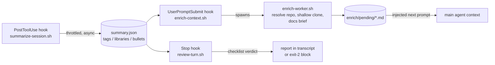

# Session context pipeline

Three cooperating hooks that give a coding-agent session a memory, a research
assistant, and a critic — all off the hot path. Every expensive step runs in a
detached background worker; the synchronous hook bodies are file stats and
reads that finish in milliseconds.



1. **Summarizer** (`PostToolUse`, throttled): every ~3 minutes _and_ ≥16 KB of
   new transcript, a cheap model distills the session into
   `summary.json` — topical tags, libraries actively in use, short
   past-tense event bullets, and a one-line focus. State lives under
   `${TMPDIR}/session-context-pipeline/<session_id>/`.
2. **Enricher** (`UserPromptSubmit`): watches the summary. For every detected
   library it resolves the canonical source repo (npm/PyPI/crates.io/Go/GitHub),
   shallow-clones it into `~/.cache/session-context-pipeline/repos/`, and
   builds a docs brief — via a headless `claude -p` pass over the clone when
   available, else a README/docs digest. Declarative custom triggers add
   project-specific notes, doc links, and file excerpts when tags or library
   names match. Finished briefs are injected as context on the next user
   prompt, including the local clone path so the agent reads real sources
   instead of guessing APIs.
3. **Reviewer** (`Stop`): at end of turn, sends the uncommitted diff plus the
   session summary through a reviewer model with a configurable checklist —
   invented unconventional solutions, missing tests, scope creep, leftover
   scaffolding, silently swallowed errors, claims not backed by the diff. In
   `report` mode the critique lands in the transcript; in `block` mode a FAIL
   verdict exits 2 and forces the agent to address the findings.

Everything fails open: missing gateway key, network down, model unavailable,
malformed JSON — the hooks exit 0 silently and the session proceeds untouched.

## When to use

- "Set up / install the session context pipeline" in a project or globally
- "Keep a running summary of what my session is doing"
- "When I use a library, pull its docs and clone it automatically"
- "Review every turn against a checklist before the agent stops"
- Long agentic sessions where the agent keeps guessing library APIs or
  shipping unreviewed work

## When NOT to use

- One-off review of a specific diff or plan — that's `end-of-turn-review`
  (this skill's reviewer is the always-on, checklist-driven sibling)
- Extracting reusable skills/patterns from a finished session — that's
  `continuous-learning`
- Anything requiring the summary to be perfect ground truth — it's a lossy,
  throttled digest by design

## Install

```bash
# project-level (recommended): <git root>/.claude/settings.json + seeded config
skills/session-context-pipeline/scripts/install-hooks.sh

# user-level: ~/.claude/settings.json
skills/session-context-pipeline/scripts/install-hooks.sh --user

# remove (same scope flags)
skills/session-context-pipeline/scripts/install-hooks.sh --uninstall
```

The installer merges idempotently into existing settings (re-running replaces
this skill's entries, never duplicates, never touches other hooks) and backs
up the settings file first. Hooks load at session start — restart Claude Code
after installing. Project installs seed `.claude/session-context-pipeline.json`
from `config.example.json`.

Requirements: `jq`, `curl`, `git` (all standard on darkmatter machines), and a
LiteLLM key (`LITELLM_API_KEY` or `~/.config/litellm/key` — same convention as
`end-of-turn-review`). A `claude` binary upgrades enrichment briefs from
README digests to targeted API excerpts; optional.

## Tools

### `scripts/install-hooks.sh`

Registers/removes the three hooks in Claude Code settings. Flags: `--user`,
`--project DIR`, `--uninstall`. See Install above.

### `scripts/summarize-session.sh`

The PostToolUse hook. Foreground: throttle checks only. `--worker` mode
(spawned detached) renders a transcript tail, calls the summarizer model, and
atomically writes `summary.json`. Model: `SCP_SUMMARY_MODEL` env >
`.summarize.model` config > `gpt-5-mini`.

### `scripts/enrich-context.sh`

The UserPromptSubmit hook. Injects finished briefs from `enrich/pending/`
(capped by `.enrich.max_pending_inject`), then fires one background
enrichment per newly detected library and evaluates declarative triggers.
Session-scoped dedupe via marker files in `enrich/done/`.

### `scripts/enrich-worker.sh`

Detached worker. Resolves the source repo per ecosystem, shallow-clones into
the shared cache (reused across sessions; `rm -rf` a clone to force refresh),
and writes the brief. Headless-agent pass runs with `SCP_DISABLE=1` so the
spawned Claude's own hooks can't re-enter this pipeline.

### `scripts/review-turn.sh`

The Stop hook. Loop-safe (`stop_hook_active` guard), dedupes identical diffs
between stops, skips trivial diffs (`.review.min_changed_lines`). Modes via
`.review.mode` or `SCP_REVIEW_MODE`: `off` | `report` (default) | `block`.
A blocked diff is deliberately not marked reviewed — stopping again without
fixing re-reviews it.

## Configuration

Resolution order: `$SCP_CONFIG` → `<project>/.claude/session-context-pipeline.json`
→ `~/.config/session-context-pipeline/config.json` → built-in defaults.
`config.example.json` documents every knob with sane defaults.

Declarative triggers (the safe, default kind):

```json
{
  "name": "effect-docs",
  "match_tags": ["effect"],
  "library_patterns": ["effect", "@effect/*"],
  "note": "Follow the effect-typescript skill conventions.",
  "docs_url": "https://effect.website/docs",
  "repo_url": "https://github.com/Effect-TS/effect",
  "excerpt_paths": ["README.md"]
}
```

Matching is case-insensitive: any summary tag in `match_tags`, or any detected
library name matching a glob in `library_patterns`. Data-only — no shell.

Command triggers (`"run": "..."`) execute shell with `SUMMARY_FILE`,
`PENDING_DIR`, `STATE_DIR` in env and are **double-gated**: both
`.enrich.allow_command_triggers: true` in config *and*
`SCP_ALLOW_COMMAND_TRIGGERS=1` in the environment. A checked-in project config
alone can never make a hook execute shell. Leave them off unless you own both
sides.

## Operational notes

- **State**: `${SCP_STATE_ROOT:-$TMPDIR/session-context-pipeline}/<session_id>/`
  — `summary.json`, `summarize.log`, `enrich.log`, `enrich/{pending,injected,done}/`,
  `review.last_sha`. Temp-dir lifecycle; the OS cleans it up.
- **Privacy**: transcript excerpts and diffs are sent to the configured
  LiteLLM gateway (drkmttr infra by default). Don't install in repos whose
  content must not transit that gateway.
- **Cost/latency**: foreground hook paths do no network I/O. Model spend is
  bounded by the summarizer throttle, per-session enrichment dedupe, and the
  reviewer's diff-hash dedupe.
- **Kill switch**: `SCP_DISABLE=1` in the environment disables every hook
  instantly; `.review.mode: "off"` and `.enrich.enabled: false` disable
  stages individually.

## Reference

- `reference/summarizer-prompt.md` — summarizer system prompt + JSON schema
- `reference/enricher-prompt.md` — headless-agent brief prompt (`{{LIBRARY}}`, `{{TAGS}}`)
- `reference/review-prompt.md` — reviewer system prompt and verdict format
- `config.example.json` — all knobs, commented by example
